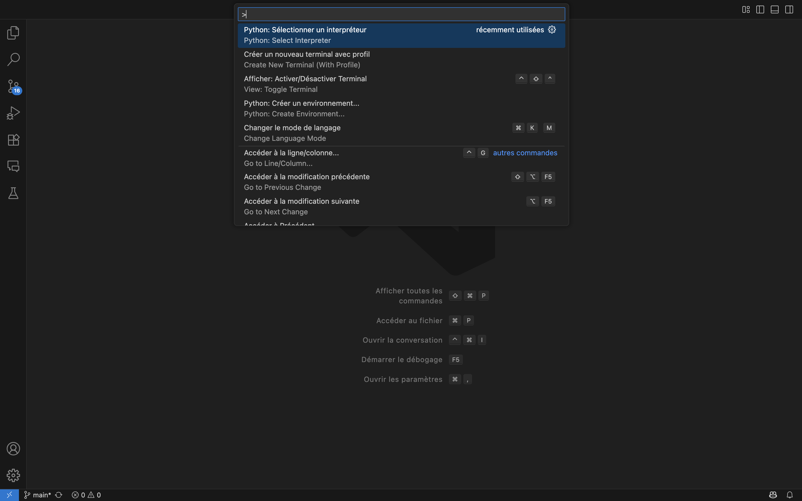
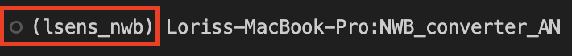
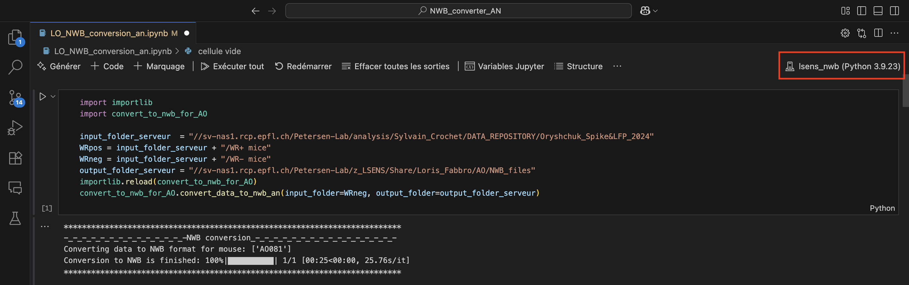

# LSENS-Lab-Immersion
Data management internship at the EPFL Brain Institute’s LSENS lab, working with published and unpublished neurophysiological datasets. This repository summarizes my work on converting data to the NWB format and developing small visualisation pipelines from some converted datasets.

For more details, you can also refer to the PDF in this repository **<LSENS-LabImmersion.pdf>**, which is my internship report and contains valuable technical information my work.


## 📁 Related Repositories
### 1. NWB Conversion Pipeline (Oryshchuk et al., 2024)


This repository converts behavioral and electrophysiological data from **Oryshchuk et al., 2024 (Cell Reports)** into the standardized **Neurodata Without Borders (NWB)** format.  
The study investigates how sensory, motor, and decision-related information is distributed and encoded in the mouse neocortex during goal-directed behavior.  

For detailed usage and dataset-specific notes, see the full README of this repository or read the internship report **<LSENS-LabImmersion.pdf>**.

Reference: 👉 [DOI](https://doi.org/10.1016/j.celrep.2023.113618)

Repository: 🔗 [Github](https://github.com/loris-fab/NWB_converter_AN.git)


#### 1.1 📊 Template Matching GUI (Oryshchuk et al., 2024)

Custom analysis interface tailored for **NWB-formatted datasets** from *Oryshchuk et al., 2024, Cell Reports*.  
Provides advanced PSTH exploration, trial-based filtering, and decoder tuning to analyze the study’s behavioral and electrophysiological recordings.

Repository: 🔗 [Github](https://github.com/loris-fab/NWB_Whisker-Stimulus-Decoding-main.git)

---
### 2. NWB Conversion Pipeline (Pierre Le Merre et al., 2018)

Converts behavioral and electrophysiological data from **Pierre Le Merre et al., 2018 (Cell Reports)** into the **Neurodata Without Borders (NWB)** format.  
The study examines how distributed brain networks encode and integrate sensory, motor, and cognitive signals during goal-directed behavior in mice.

For detailed usage and dataset-specific notes, see the full README of this repository or read the internship report **<LSENS-LabImmersion.pdf>**.

Reference: 👉 [DOI](https://pmc.ncbi.nlm.nih.gov/articles/PMC5766832/)

Repository: 🔗 [Github](https://github.com/loris-fab/NWB_Converter_LeMerre.git)

---

### 3. NWB Conversion Pipeline (Lila Banterle et al., unpublished, 2025)

Converts **single-neuron membrane potential recordings** from the medial prefrontal cortex (mPFC) of awake behaving mice into the **Neurodata Without Borders (NWB)** format.

The dataset includes two experimental conditions:

Since there is no published article yet, the dataset contains single-neuron membrane potential recordings from the medial prefrontal cortex of awake mice: Whisker rewarded (WR+) mice received water if they licked within 1 s after a whisker stimulus (go trials), but not in no-go trials; No-Task mice were head-fixed and received random whisker stimuli without a task. Recordings were obtained using whole-cell patch-clamp.

For detailed usage and dataset-specific notes, see the full README of this repository or read the internship report **<LSENS-LabImmersion.pdf>**.

Repository: 🔗 [Github](https://github.com/loris-fab/NWB_converter_PB.git)


## ⚙️ Environment setup


If you are working on EPFL computers, a practical workaround, is to create the environment directly from Anaconda in a terminal, within the same directory as the `requirements.txt` file. Once the environment has been created, *Visual Studio Code* should be opened independently (i.e., not launched via Anaconda). This approach helps to avoid potential issues that may arise on EPFL computers due to their connection to central servers and ensures that the interpreter correctly detects and uses the previously created environment.


### Install Anaconda

1. Download the installer from [Anaconda official website](https://www.anaconda.com/download).  
2. Verify installation:  
   ```bash
   conda --version
   ```
### Create and activate an environment:

Download the **requirements.txt** file from the current repository.  
Then, open a terminal in the same directory and run the following command:


```bash
conda create -n nwb_env python=3.9
conda activate nwb_env
python -m pip install --upgrade pip wheel setuptools && pip install -r requirements.txt
```

After this setup, you should clone the corresponding repository that you wish to work with.

## 🏁 Verification


Whether you run the code from the **terminal** or from **Jupyter**, it is essential to ensure that you are using the correct environment. If you are working in *Visual Studio Code*, follow this steps:

### **Terminal:**

- Python: select an interpreter and choose the environment you just created (`lsens_nwb`).



- Open a terminal in Visual Studio Code, create a new terminal with your desired profile, and select bash.


- Ensure that you are using the correct environment.



### **Jupyter:** 
In Jupyter, check the top-right corner to ensure that the pipeline is running in the correct environment. If it is not, click on it and select the `lsens_nwb` environment.



